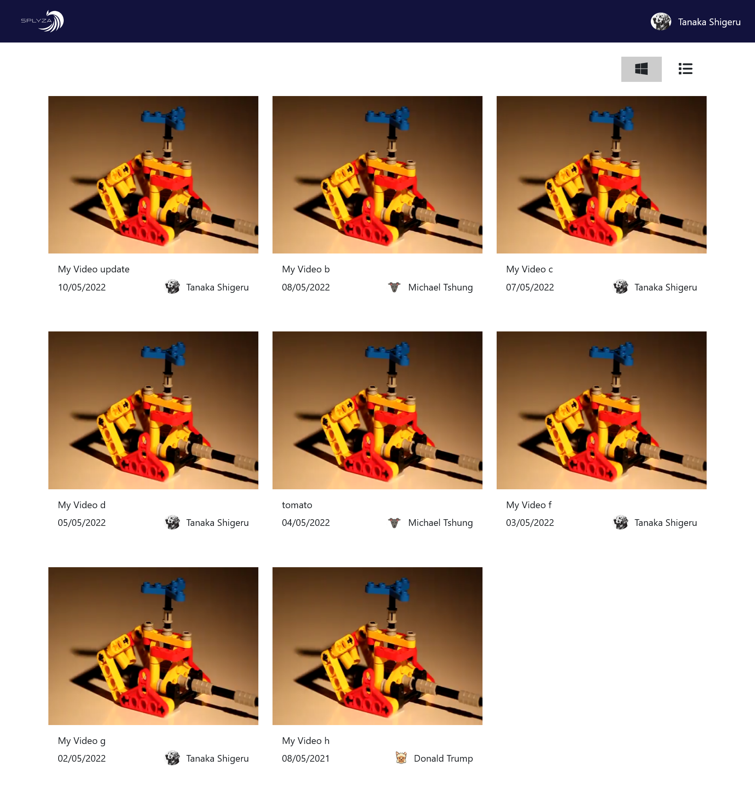
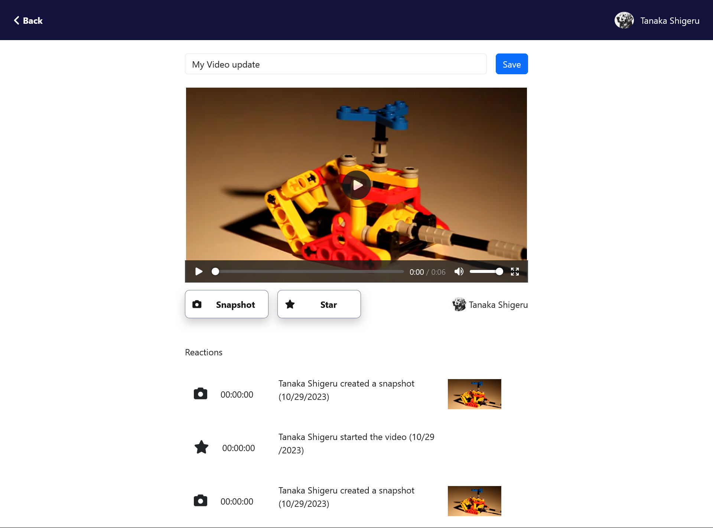

# SPLYZA Video Box Web Application

Welcome to the SPLYZA Video Box web application project. This application allows users to view and react to videos hosted by a REST API. Here is a guide to help you understand and work on this project.

## Table of Contents
- [Project Overview](#project-overview)
- [Requirements](#requirements)
- [Design Details](#design-details)
- [Optional Feature](#optional-feature)
- [REST API Details](#rest-api-details)
- [Challenge](#challenge)

## Project Overview

SPLYZA Video Box is a web application developed using Angular. It consists of two main screens:

## How to Build and Run

To build and run the SPLYZA Video Box web application, follow these steps:

1. Clone the repository containing your Angular project.
2. Navigate to `video-portal` directory  Install the necessary dependencies using npm or yarn.
3. Configure the application to connect to the REST API backend by specifying the correct API endpoint.
4. Run the Angular application using the command `ng serve`.
5. Access the application in your web browser at the specified URL (e.g., http://localhost:4200).

## REST API Details

For handling API requests, you can use the REST API backend provided in the [GitHub repository](https://github.com/splyza/video-box-server/tree/main). Follow the instructions in the README file of that repository to set up the server.

- The provided backend does not have authentication or authorization; it uses a default user for all requests.

1. **Video List Screen (Screen 1)**

   - Displays a list of all the videos hosted on the cloud service.
   - Allows users to switch between list and grid views.
   - Clicking on a video opens the Video Details screen.
   - Provides a way to interact with video reactions.

2. **Video Details Screen (Screen 2)**

   - Displays the selected video with player controls.
   - Allows editing of the video title for videos owned by the logged-in user.
   - Provides options to play/pause the video.
   - Shows a list of reactions (Stars and Snapshots) associated with the video.
   - Offers the ability to add reactions at specific timestamps.
   - Allows users to click on reactions to navigate the video.

## Requirements

The application is built using Angular and interacts with a REST API. Here are the core requirements:

- Use Angular for development.
- Implement a Video List screen with the ability to switch between list and grid views.
- Implement a Video Details screen for viewing and interacting with individual videos.
- Use REST API endpoints to fetch video data and interactions.
- Implement features for video reactions, including Stars and Snapshots.
- Allow users to edit video titles for videos they own.
- Provide navigation back to the Video List screen.
- Ensure that modifications to videos are reflected in the Video List.

## Design Details

The design details for this application can be found in the [Figma file](https://www.figma.com/file/rl0Uj2w5GWfDBWxGsDkdWJ/DC%E2%9C%85-WEB-CHALLENGE-(design)?type=design&node-id=0%3A1&mode=design&t=QdXnYHjFh51VWTwD-1). Please refer to this file for UI/UX guidance.

